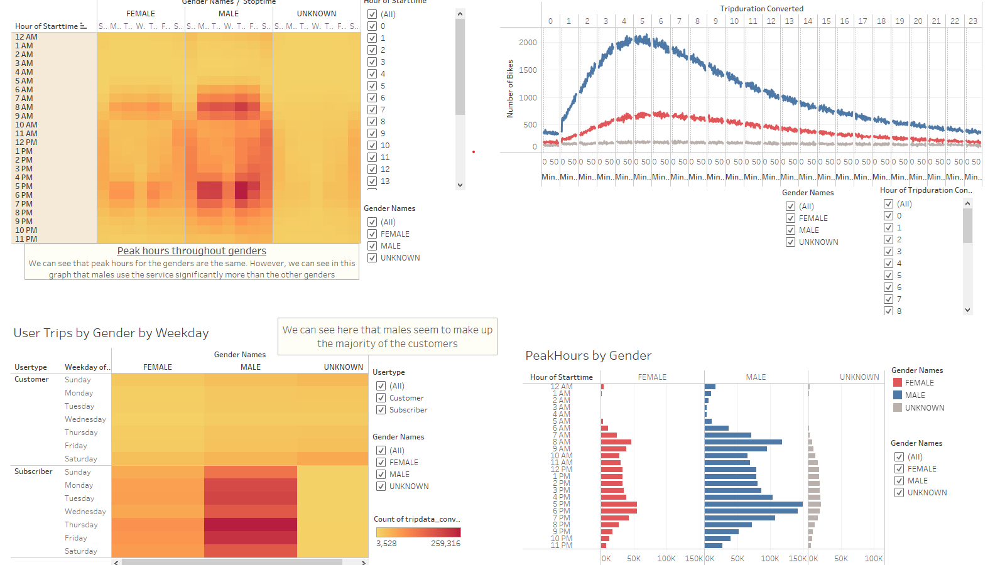
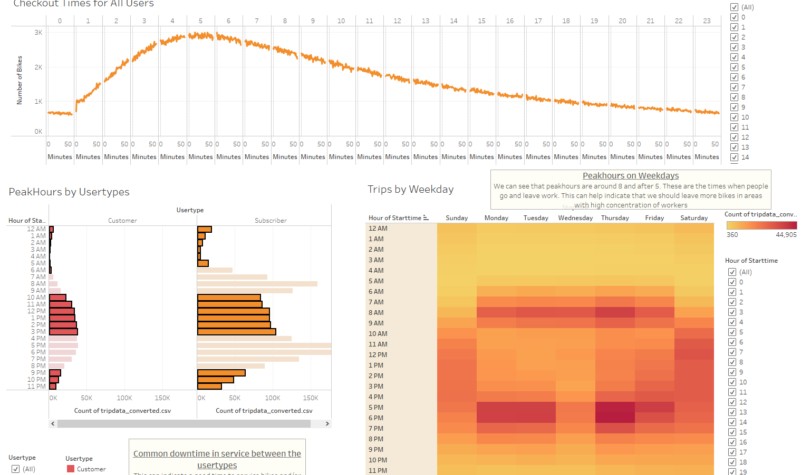

# Citibike Data Analysis

## Overview
In this analysis, we look into bikesharing data recorded in New York City. Our goal is to solidify a buisness proposal by showing our investors visualizations of our bike trip analysis. We use the Python library, Pandas, to clean and organize the data we need for analysis. We then use Tableau to create visual story of our findings in the data.
 
## Results
Using the 7 visualizations, we have determined multiple business plans that can ensure a successful company. These visualizations can be followed through my [Tableau dashboard link](https://public.tableau.com/app/profile/yubi.quinzon/viz/Bikeshare_16540523049430/CitibikeAnalysis?publish=yes).
 
### Gender Bikeshare Analysis

Throughout the data, we clearly see that Males tend to use the buissness significantly more than the other genders. Using this information, we can assume the types of use that the bikes would most commonly be under. For example, Males tends to be more reckless than the other genders. We can conclude that having more durable bikes will benefit the company over time as they would be able to withstand the expected abuse. This would help cut cost on repairs/replacements/etc.

### Bikeshare Service Analysis

In this page, we can see multiple visualizations that will help create bussiness plans for time of operations. What we can take from this page is that the bikes are generally used for an extensive period at a time. This helps support our claim of investing in more durable bikes to benefit the company in the long run. The next thing to note is that subscribers are the most types of users that utilize our service by a significant amount. Using this information, we maximize profit by including subscriber only benefits. In our visualizations, We can also see the peak hours of service. We can conclude that most users use our service to get to and from work. Knowing this information, we can determine the best places to place our bikes and when to service them.

## Summary
In summary, looking at the visualizations, we can conclude that the bikesharing business has a high potential for successs. Using all the business plans reccommended, I believe this is a good business to invest in.
